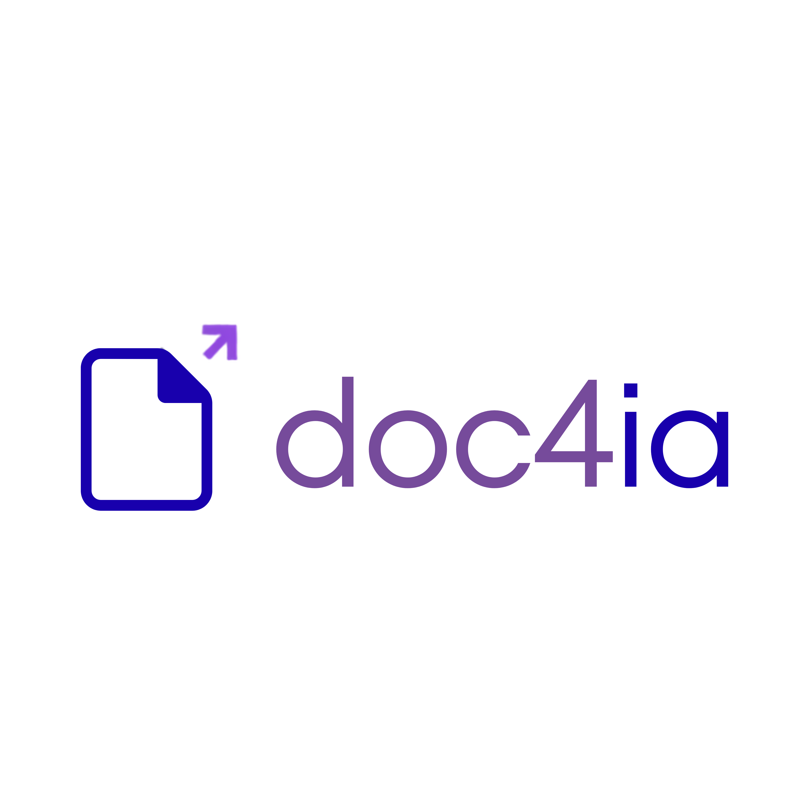

<p align="center">
  
</p>

<h1 align="center">doc4ai — Conversor de Documentos para IA</h1>

<p align="center">
  <a href="https://www.python.org/"></a>
  <a href="https://www.djangoproject.com/"></a>
  <a href="https://www.docker.com/"></a>
  <a href="https://render.com/"></a>
  <a href="https://gunicorn.org/"></a>
  <a href="http://whitenoise.evans.io/"></a>
  <a href="https://github.com/microsoft/markitdown"></a>
  <a href="https://github.com/tesseract-ocr/tesseract"></a>
  <a href="https://poppler.freedesktop.org/"></a>
  <a href="https://pywebview.flowrl.com/"></a>
  <a href="https://pyinstaller.org/"></a>
  <a href="./LICENSE"></a>
</p>

<p align="center">
  <a href="https://doc4ai-own5.onrender.com"><b>🌐 Acessar o deploy no Render</b></a>
  ·
  <a href="https://github.com/claulis/doc4ai/releases/latest/download/doc4ai.exe"><b>⬇ Baixar versão desktop (Windows)</b></a>
</p>

Converta qualquer documento para **Markdown** com um clique. O formato Markdown economiza tokens ao eliminar o ruído de formatação de arquivos como `.docx`, `.pdf` ou `.html`, mantendo apenas a estrutura semântica essencial — o formato que modelos de linguagem entendem e processam com mais precisão e eficiência.

## Índice

- [Funcionalidades](#funcionalidades)
- [Vantagens](#vantagens)
- [Formatos suportados](#formatos-suportados)
- [Como começar](#como-começar-get-started)
- [Deploy](#deploy)
- [Como funciona o processamento](#como-funciona-o-processamento)
- [Arquitetura de software](#arquitetura-de-software)
- [Design patterns utilizados](#design-patterns-utilizados)
- [Stack](#stack)
- [Estrutura do projeto](#estrutura-do-projeto)
- [Segurança](#segurança)
- [Variáveis de ambiente](#variáveis-de-ambiente)
- [Licenças e avisos legais](#licenças-e-avisos-legais)

## Funcionalidades

- **Conversão para Markdown** de mais de 20 formatos de arquivo em um clique (documentos, planilhas, apresentações, imagens, e-mails, áudio, HTML/texto).
- **OCR automático** para PDFs digitalizados sem camada de texto e para imagens (fotos de documentos, cartazes, folhetos), via Tesseract + Poppler.
- **Interface multilíngue** — 8 idiomas (Português, Inglês, Italiano, Alemão, Francês, Espanhol, Chinês, Hindi), com detecção automática do idioma do navegador.
- **Versão desktop offline** para Windows — executável único, sem instalação e sem dependência de rede, com a mesma interface e lógica de conversão do site.
- **Processamento transiente** — o arquivo enviado é convertido e apagado imediatamente em seguida; nada é armazenado ou compartilhado com terceiros.

## Vantagens

- **Economia de tokens:** Markdown remove marcação redundante de `.docx`/`.pdf`/`.html`, reduzindo o custo e aumentando a precisão de prompts para LLMs.
- **Privacidade por padrão:** toda a conversão e o OCR rodam localmente no próprio servidor (ou na sua máquina, na versão desktop) — nenhum arquivo é enviado a serviços externos de IA ou nuvem.
- **Leve o suficiente para rodar em instância gratuita:** pipeline de OCR otimizado (downscale de imagem, orçamento de tempo, processamento página a página) para operar dentro de 512 MB de RAM.
- **Resiliente a documentos ruins:** validação de assinatura de bytes, proteção contra zip bomb e limites de tamanho evitam que um arquivo malformado derrube o processo.
- **Mesmo código, três formas de rodar:** web (Docker/Render), desktop (Windows, offline) e desenvolvimento local — sem bifurcação de lógica entre eles.

## Formatos suportados

| Categoria | Extensões |
|-----------|-----------|
| Documentos | PDF, DOCX, DOC, PPTX, PPT, XLSX, XLS |
| Web / Texto | HTML, HTM, CSV, JSON, XML, TXT |
| Imagens | JPG, JPEG, PNG, GIF, BMP, TIFF, TIF |
| Outros | EPUB, ZIP, MP3, WAV, MSG |

> PDFs sem camada de texto e todas as imagens são processados automaticamente via OCR (Tesseract + Poppler).

## Como começar (Get Started)

### Pré-requisitos

- Python 3.12+
- [Tesseract OCR](https://github.com/tesseract-ocr/tesseract) e [Poppler](https://poppler.freedesktop.org/) instalados e no `PATH` (para o fallback de OCR)

### Rodando localmente

```bash
# Clonar o repositório
git clone https://github.com/claulis/doc4ai.git
cd doc4ai

# Instalar dependências
pip install -r requirements.txt

# Configurar variáveis de ambiente
export DJANGO_SECRET_KEY="sua-chave-secreta"
export DJANGO_DEBUG=True

# Coletar arquivos estáticos e iniciar
python manage.py collectstatic --noinput
python manage.py runserver
```

Acesse `http://localhost:8000`.

### Rodando com Docker

```bash
docker build -t doc4ai .
docker run -p 10000:10000 -e DJANGO_SECRET_KEY="sua-chave-secreta" doc4ai
```

### Versão desktop (Windows)

Baixe o executável pronto em [Releases](https://github.com/claulis/doc4ai/releases/latest/download/doc4ai.exe) ou veja como gerar seu próprio build em [`desktop/README.md`](desktop/README.md).

## Deploy

A instância pública roda no [Render](https://render.com/), a partir da mesma imagem Docker deste repositório (`Dockerfile` + `render.yaml`):

**🌐 https://doc4ai-own5.onrender.com**

## Como funciona o processamento

1. **Upload** — o arquivo é enviado por POST (`/convert`), limitado a 10 requisições/minuto por IP.
2. **Validação em camadas**, nesta ordem:
   - extensão contra uma lista de permissão (`ALLOWED_EXTENSIONS`);
   - tamanho máximo de 50 MB;
   - assinatura de bytes (*magic bytes*) do arquivo, comparada à extensão declarada;
   - para formatos baseados em ZIP (`.docx`, `.xlsx`, `.pptx`, `.epub`, `.zip`), verificação de tamanho descomprimido para bloquear *zip bombs*.
3. **Roteamento por tipo:**
   - **Imagens** (`.jpg`, `.png`, `.gif`, `.bmp`, `.tiff`...) vão direto para o Tesseract — o MarkItDown não faz OCR real de imagem sem um cliente LLM, então essa etapa é pulada para não pagar o custo de suas dependências pesadas.
   - **Demais formatos** passam pelo **MarkItDown**, que já sabe extrair Markdown de PDF, DOCX, XLSX, PPTX, HTML, e-mails (`.msg`), EPUB, ZIP, áudio, etc.
   - **PDF sem camada de texto** (digitalizado) cai automaticamente no fallback de **OCR página por página**: cada página é rasterizada individualmente pelo Poppler (`pdftoppm`) e passada ao Tesseract, o que mantém o pico de memória limitado a uma página por vez em vez do documento inteiro.
4. **Orçamento de tempo e páginas** — o OCR de PDF respeita um teto de páginas e um orçamento de tempo total; se o documento não terminar a tempo, o texto já reconhecido é devolvido em vez de falhar a conversão inteira (o proxy reverso da hospedagem encerra a conexão em ~60 s de qualquer forma).
5. **Resposta e limpeza** — o Markdown resultante é devolvido como JSON e o arquivo temporário é **sempre apagado** no `finally`, mesmo em caso de erro. Nada do conteúdo enviado é persistido ou logado.

## Arquitetura de software

O projeto segue o padrão **MVT (Model-View-Template)** do Django, mas sem camada de persistência — não há banco de dados, já que nenhum estado precisa sobreviver além da requisição de conversão.

```
Requisição HTTP
      │
      ▼
┌─────────────────────────────┐
│ Middleware chain             │  SecurityMiddleware → LocaleMiddleware →
│ (doc4ai/middleware.py)        │  WhiteNoise → CommonMiddleware → CSRF →
│                               │  XFrameOptions → SecurityHeadersMiddleware
└─────────────────────────────┘
      │
      ▼
┌─────────────────────────────┐
│ View (converter/views.py)    │  valida upload, decide a rota de conversão
└─────────────────────────────┘
      │            │
      ▼            ▼
┌───────────┐  ┌──────────────────────────┐
│ MarkItDown │  │ Tesseract + Poppler       │  via converter/binary_locator.py
│ (facade)   │  │ (OCR direto ou por página)│  (resolve o binário certo por ambiente)
└───────────┘  └──────────────────────────┘
      │            │
      └─────┬──────┘
            ▼
      Template (index.html) + JSON de resposta
```

O mesmo código roda em **três ambientes** sem bifurcação de lógica:

| Ambiente | Servidor | Empacotamento |
|----------|----------|----------------|
| Web (produção) | Gunicorn atrás do proxy do Render | Imagem Docker (`Dockerfile`) |
| Desktop (Windows) | Waitress (WSGI puro-Python, sem `fork()`) + janela nativa via PyWebview | Executável único via PyInstaller |
| Desenvolvimento local | `runserver` do Django | — |

`converter/binary_locator.py` é o ponto que torna isso possível: resolve o caminho de `tesseract`/`pdftoppm` de forma diferente em cada ambiente (`PATH` do sistema em produção, `sys._MEIPASS` no executável empacotado, caminho padrão do Windows em dev local), sem que `views.py` precise saber em qual dos três está rodando.

## Design patterns utilizados

- **MVT (Model-View-Template):** estrutura padrão do Django — `views.py` concentra a lógica de aplicação e delega a renderização ao `template`, sem `models.py` por não haver persistência.
- **Facade:** `MarkItDown().convert_local(...)` expõe uma única interface para dezenas de formatos de documento distintos, escondendo os parsers específicos de cada um.
- **Strategy:** `binary_locator.py` seleciona em tempo de execução a estratégia de resolução de binário (produção/Docker, executável PyInstaller ou dev local) sem que o código chamador precise conhecer o ambiente.
- **Chain of Responsibility:** a pilha de `MIDDLEWARE` do Django (incluindo o `SecurityHeadersMiddleware` customizado) processa cada requisição através de uma cadeia de responsabilidades encadeadas.
- **Decorator:** as views usam decorators compostos (`@ensure_csrf_cookie`, `@require_POST`, `@ratelimit`) para adicionar comportamento transversal (CSRF, método HTTP, rate limiting) sem alterar a função da view.
- **Adapter:** `desktop/launcher.py` adapta a mesma aplicação Django — pensada para HTTP em produção — para rodar como app desktop offline, trocando Gunicorn por Waitress e o navegador por uma janela nativa PyWebview.

## Stack

| Camada | Tecnologia |
|--------|-----------|
| Framework web | [Django](https://www.djangoproject.com/) 5.x |
| Conversão de documentos | [MarkItDown](https://github.com/microsoft/markitdown) |
| OCR (fallback PDF/imagem) | [Tesseract](https://github.com/tesseract-ocr/tesseract) + [Poppler](https://poppler.freedesktop.org/) |
| Servidor WSGI (produção) | [Gunicorn](https://gunicorn.org/) |
| Servidor WSGI (desktop) | [Waitress](https://github.com/Pylons/waitress) |
| UI nativa (desktop) | [PyWebview](https://pywebview.flowrl.com/) |
| Empacotamento (desktop) | [PyInstaller](https://pyinstaller.org/) |
| Arquivos estáticos | [WhiteNoise](http://whitenoise.evans.io/) |
| Rate limiting | [django-ratelimit](https://django-ratelimit.readthedocs.io/) |
| Processamento de imagem | [Pillow](https://python-pillow.org/) |
| Frontend | Vanilla JS + CSS (sem dependências) |
| Containerização | [Docker](https://www.docker.com/) |
| Deploy | [Render](https://render.com/) (Docker) |

## Estrutura do projeto

```
doc4ai/
├── converter/              # App Django: views, rotas, templates, estáticos
│   ├── views.py             # Validação de upload + roteamento de conversão/OCR
│   ├── binary_locator.py    # Resolve tesseract/pdftoppm por ambiente
│   ├── templates/converter/
│   └── static/converter/    # CSS, JS e imagens do frontend
├── doc4ai/                  # Configuração do projeto Django
│   ├── settings.py
│   ├── middleware.py        # Headers de segurança customizados
│   └── urls.py / wsgi.py
├── desktop/                 # Build desktop (Windows)
│   ├── launcher.py          # Entry point: waitress + pywebview
│   ├── doc4ai.spec          # Spec do PyInstaller
│   └── bin/                 # Tesseract e Poppler portáteis empacotados
├── locale/                  # Traduções (8 idiomas)
├── Dockerfile               # Imagem de produção
├── render.yaml              # Configuração de deploy no Render
├── LICENSE
├── THIRD-PARTY-LICENSES.md
├── PRIVACY-NOTICE.md
└── DISCLAIMER.md
```

## Segurança

- Validação de assinatura de bytes (magic bytes) para cada tipo de arquivo
- Proteção contra zip bombs (limite de 512 MB descomprimido)
- Limite de upload de 50 MB por arquivo
- Rate limiting de 10 requisições/minuto por IP
- CSRF habilitado em todas as rotas POST
- Headers de segurança via middleware customizado (CSP, Referrer-Policy, Permissions-Policy)
- Container roda como usuário não-root

## Variáveis de ambiente

| Variável | Padrão | Descrição |
|----------|--------|-----------|
| `DJANGO_SECRET_KEY` | *(obrigatório em produção)* | Chave secreta do Django |
| `DJANGO_DEBUG` | `False` | Ativa modo debug |
| `DJANGO_ALLOWED_HOSTS` | `localhost,127.0.0.1` | Hosts permitidos (separados por vírgula) |
| `DJANGO_CSRF_TRUSTED_ORIGINS` | `http://localhost,http://127.0.0.1` | Origens confiáveis para CSRF |
| `DJANGO_SECURE_SSL_REDIRECT` | `False` | Redireciona HTTP → HTTPS |
| `DJANGO_HSTS_SECONDS` | `0` | Duração do HSTS em segundos |

## Licenças e avisos legais

Este projeto é **source-available e não-comercial**. Antes de usar, ler:

| Arquivo | Conteúdo |
|---------|----------|
| [`LICENSE`](./LICENSE) | doc4ai Noncommercial License 1.0 — uso, estudo e redistribuição permitidos para fins não-comerciais |
| [`THIRD-PARTY-LICENSES.md`](./THIRD-PARTY-LICENSES.md) | Licenças dos componentes de terceiros (MarkItDown/MIT, Poppler/GPLv2, Tesseract/Apache 2.0, e outros) |
| [`PRIVACY-NOTICE.md`](./PRIVACY-NOTICE.md) | Como o doc4ai trata dados enviados (LGPD/GDPR) — resumo: nada é armazenado |
| [`DISCLAIMER.md`](./DISCLAIMER.md) | Isenção de garantia sobre qualidade de conversão/OCR e responsabilidade pelo conteúdo enviado |
